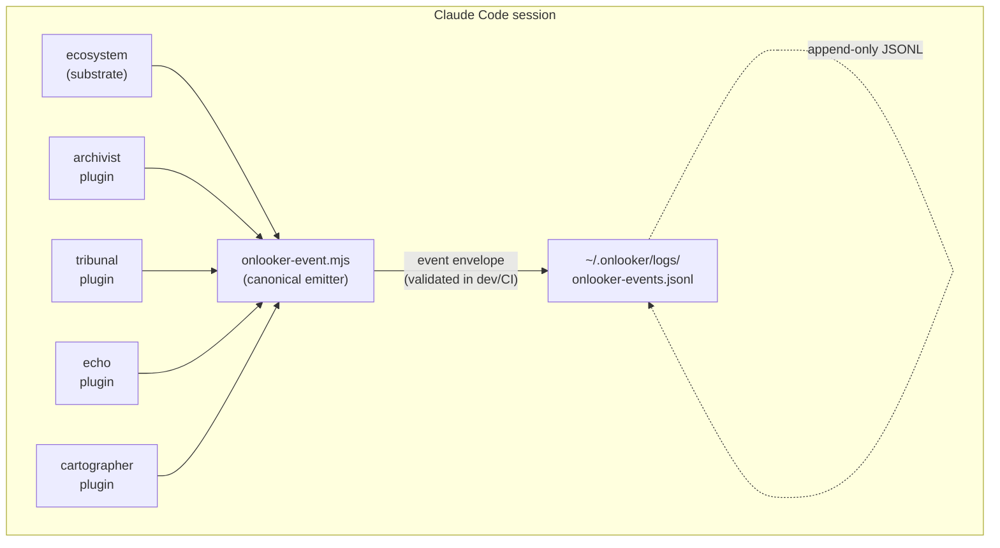

# Ecosystem Architecture

This document describes how the Onlooker ecosystem fits together: the shared substrate, the plugin layer, the event bus, and the configuration system.

## Overview



## The substrate layer: `ecosystem`

The `ecosystem` plugin (repo root) is not optional — it provides the infrastructure every other plugin builds on:

| Component | What it does |
|-----------|-------------|
| `~/.onlooker/` directory | Shared storage root, created by the Onlooker installer. All plugins store artifacts here under their own sub-path. |
| `scripts/lib/onlooker-event.mjs` | Canonical event builder. Accepts a JSON payload on stdin and prints a canonical envelope to stdout; callers capture it and append to the JSONL log. **Dependency-free and fail-open**: it validates against `@onlooker-community/schema` only when that package is resolvable (dev/CI) and emits unconditionally otherwise, so a fresh marketplace install — which ships no `node_modules` — never loses telemetry. See [ADR-005](adr/005-runtime-emitter-fails-open.md). |
| `scripts/lib/onlooker-schema.sh` | Bash convenience wrapper around `onlooker-event.mjs`. Provides `onlooker_event_from_hook` (builds an envelope via `node`) and `onlooker_append_event` (appends a pre-built envelope to the log). Node is still required. |
| `scripts/lib/validate-path.sh` | Sets canonical `$ONLOOKER_*` environment variables (log path, tracker dirs, etc.) so every hook uses consistent paths. |
| Session trackers | `SessionStart`, `SessionEnd`, `PreCompact`, `PostCompact`, `PreToolUse`, `PostToolUse`, `UserPromptSubmit`, `TaskCreated`, `TaskCompleted`, `WorktreeCreate`, and `WorktreeRemove` hooks that emit `session.*`, `tool.*`, `turn.*` events for the observability layer. |
| Prompt rules | `UserPromptSubmit` hook that injects declarative guidance on regex match. |

## The plugin layer

Plugins are independent packages under `plugins/<name>/`. Each has its own:
- `config.json` — defaults for all knobs.
- `hooks.json` — declares which Claude Code hook events to subscribe to.
- `.claude-plugin/plugin.json` — marketplace manifest (name, version, description, agents, skills).
- `CHANGELOG.md` + release-please track — versioned independently of the ecosystem.

Plugins communicate by **emitting events**, not by calling each other directly. An Echo evaluation and a Tribunal jury run both write to the same JSONL log; a dashboard or downstream consumer can query across both.

### Cartographer

[Cartographer](../plugins/cartographer) is the only proactive plugin in the ecosystem. Rather than reacting to tool calls or session events, it runs a periodic background audit of your entire persistent instruction layer (`CLAUDE.md`, `AGENTS.md`, `.claude/rules/`). It surfaces four finding types — `contradiction`, `dead_rule`, `stale_ref`, and `scope_collision` — and emits each as a `cartographer.issue.found` event before the misbehavior they would cause ever occurs.

Findings are stored in `~/.onlooker/cartographer/<project-key>/findings/` and delivered at-least-once (deduplicated on `payload.finding_hash`). The audit runs as a detached background process; your session is never blocked.

### Bursar

[Bursar](../plugins/bursar) is the clearest example of one plugin consuming another's output **through the bus rather than by direct coupling**. Governor tracks spend per session and emits `governor.session.complete`; bursar reads those events at `SessionEnd`, rolls each session's totals into a per-project ledger under `~/.onlooker/bursar/projects/<project-key>/`, and surfaces "this project burned $X this week" at the next `SessionStart`. It never imports governor's code — if governor is disabled the events simply aren't there, and bursar degrades to a session count. This is the dependency model working as intended: the cross-session rollup is a separate, independently installable plugin that observes governor's event stream.

### Lineage

[Lineage](../plugins/lineage) is the provenance graph — it answers "why does this line exist?" by **joining its own tool-use records to another plugin's transcript store**. On `PostToolUse` it records each `Edit`/`Write`/`MultiEdit` (content-anchored, secret-redacted) into a per-project ledger under `~/.onlooker/lineage/<project-key>/`. The originating prompt is resolved lazily at query time: the `/lineage` skill reads the change ledger, content-anchors a line to the change that introduced it, and joins to [historian](../plugins/historian)'s durable per-session chunks (`start_turn_index`/`end_turn_index`) to recover the conversation context — falling back to the live transcript, then to "unavailable." Historian is the join target precisely because it persists transcripts long after the ephemeral `transcript_path` is gone; lineage stays decoupled and degrades gracefully when historian is absent.

### Plugin dependency model

All plugins depend on `ecosystem`. No plugin depends on another plugin at runtime. This means:
- Tribunal does not require Archivist to be installed.
- Echo does not require Tribunal to be installed (despite evaluating similar things — see [Echo ADR-002](../plugins/echo/docs/adr/002-direct-evaluation-vs-tribunal-pipeline.md)).
- Cartographer does not require any other plugin — it reads instruction files directly and emits events independently.
- You can install any subset of plugins and the others still work.

## The event bus

Every observable event flows through `onlooker-event.mjs` before being written to disk. The emitter:

1. Wraps the plugin-supplied payload in a canonical envelope:
   ```json
   {
     "id": "01J...",
     "plugin": "echo",
     "session_id": "...",
     "event_type": "echo.suite.complete",
     "timestamp": "2026-05-24T...",
     "schema_version": "2.2.0",
     "payload": { ... }
   }
   ```
2. Validates the envelope and payload against [`@onlooker-community/schema`](https://github.com/onlooker-community/schema). If validation fails, the node process exits non-zero and prints to stderr; most hooks treat empty output as a skip rather than a hard error, so some validation failures may be silent unless the caller explicitly checks exit status.
3. Prints the validated envelope to stdout. The calling bash function (`onlooker_append_event`) captures this and appends it as a single JSON line to `~/.onlooker/logs/onlooker-events.jsonl`.

The schema is versioned independently and published to npm. Plugin shell scripts invoke `onlooker-event.mjs` at runtime so schema validation always reflects the installed version.

> **Note:** Not all events in the JSONL log are schema-validated. `prompt_rule.*` events are currently emitted outside the canonical schema pipeline (the event types are not yet defined in `@onlooker-community/schema`). Schema-first emission is the goal for all future event types.

## Project keying

Every plugin that stores per-project artifacts uses the same key derivation:

```
key = first 12 hex chars of SHA256(git remote get-url origin)
```

If no remote exists (local-only repo), the key falls back to `SHA256(realpath of git toplevel)`.

This means:
- Two clones of the same repo share the same key and therefore the same baselines, memories, and Tribunal history.
- Git worktrees of the same repo also share the key.
- Moving the repo directory does not change the key (remote URL is stable).

## Configuration system

Each plugin reads config in two steps:

1. **Plugin defaults** — `plugins/<name>/config.json`. Ships with the plugin; defines all available knobs and their defaults.
2. **Settings overlay** — `.claude/settings.json` (repo-level) or `~/.claude/settings.json` (global). The plugin-specific key (e.g., `echo`, `tribunal`) is merged onto the defaults.

Tribunal and Archivist use a recursive `deepmerge` so nested keys can be overridden individually without replacing an entire sub-object. Echo uses a simpler per-key lookup against the flat settings block. Repo-level settings take precedence over global; both override plugin defaults. This lets you:
- Enable a plugin for a specific project without touching your global config.
- Override the evaluation model for a high-stakes repo without affecting others.

## Architecture decisions

Ecosystem-level decisions are recorded in [`docs/adr/`](adr/):

- [ADR-001](adr/001-claude-code-hooks-as-integration-surface.md) — Claude Code hooks as the integration surface
- [ADR-002](adr/002-centralized-jsonl-event-log.md) — Centralized JSONL event log with schema validation
- [ADR-003](adr/003-ulid-over-uuid.md) — ULID for all identifiers
- [ADR-004](adr/004-plugin-config-with-settings-overlay.md) — Per-plugin config with settings.json overlay
