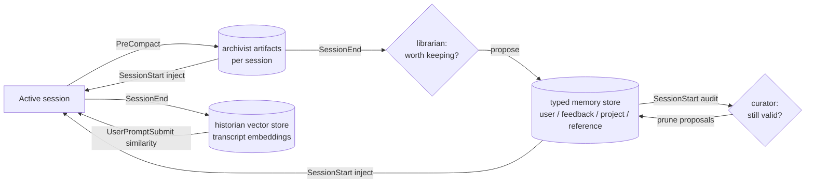

# Memory Architecture

This document describes how the Onlooker ecosystem manages memory across timescales — from the in-session working context, through compaction-resistant session memory, into durable cross-session knowledge, and back out as just-in-time recall.

It is the companion to [`architecture.md`](architecture.md), which describes the substrate. This doc describes how the memory-flavored plugins compose on top of it.

---

## The four timescales

| Timescale | Lifetime | Substrate | Plugin |
|-----------|----------|-----------|--------|
| Working | Within one model turn | Conversation context window | (the model itself) |
| Session | One Claude Code session, across compactions | `~/.onlooker/archivist/<project-key>/` | **archivist** |
| Durable | Across sessions, weeks–months | `~/.claude/projects/<encoded-project>/memory/` | **librarian**, **curator** |
| Episodic | Across sessions, retrieved on similarity | `~/.onlooker/historian/<project-key>/` | **historian** |

Each plugin operates on exactly one substrate. They communicate by events, not by reaching across substrates.

---

## The pipeline

### Flow of a fact

A non-obvious project fact ("the auth migration is driven by legal, not tech debt") goes through:

1. **Captured during session** — surfaces in the conversation, lands in the transcript.
2. **Extracted at compaction by archivist** — written as a `decisions/<ulid>.json` artifact when context fills.
3. **Reinjected by archivist next session** — appears in `additionalContext` if it ranks within the recency/pinning budget. The fact survives session boundaries but lives in a per-session, recency-ranked space.
4. **Promoted by librarian** — at session end (or on demand), librarian decides "this should be a `project` memory" and writes it to the typed memory store with provenance pointing back to the archivist artifact.
5. **Audited by curator** — periodically, curator checks whether the **Why:** is still load-bearing (has the legal review concluded? did the migration land?). If stale, curator surfaces a prune proposal.
6. **Recalled by historian (separately)** — if a future session encounters a similar problem ("we're being asked to rip out X middleware again"), historian retrieves the transcript chunk from the original session where this was discussed, providing fuller context than the distilled project memory can carry.

---

## Boundaries between memory plugins

The memory plugins overlap in spirit but operate on different substrates and answer different questions. Misunderstanding these boundaries is the most likely failure mode.

| Plugin | Question it answers | Storage | Trigger |
|--------|---------------------|---------|---------|
| archivist | "What did we decide / try / leave open in *this* session?" | `~/.onlooker/archivist/<project-key>/` | PreCompact, SessionStart |
| librarian | "Which of those decisions deserves to live forever?" | `~/.claude/projects/<encoded-project>/memory/` (writes proposals; user confirms) | SessionEnd, scheduled |
| curator | "Which of our durable memories are now wrong, stale, or contradictory?" | reads & proposes prunes against the typed memory store | SessionStart (cheap), scheduled (LLM) |
| historian | "Have we seen something like this before, and if so, what happened?" | `~/.onlooker/historian/<project-key>/` (embeddings) | SessionEnd, UserPromptSubmit |
| scribe | "What's a readable artifact of what we did?" | scribe's own output dir | session end |
| cartographer | "Are the instruction files (CLAUDE.md, AGENTS.md, rules/) internally consistent?" | reads instruction files; emits findings | SessionStart, instruction-file writes |
| counsel | "What does the *event log* across all plugins tell us to improve?" | reads JSONL log; produces brief | weekly |

**The two easiest confusions:**

1. **cartographer vs. curator.** Cartographer audits the *instruction files* the user maintains by hand (CLAUDE.md, AGENTS.md, `.claude/rules/`). Curator audits the *typed auto-memory store* the librarian writes into. Same shape of audit, different substrate. They are parallel, not redundant.

2. **archivist vs. librarian.** Archivist keeps everything from a session, ranked by recency, and reinjects into the next one. Librarian promotes a small subset into the typed memory store where it will be reinjected *every* session, with classification (user/feedback/project/reference) and provenance.

---

## Shared invariants

All three new memory plugins follow the ecosystem conventions:

- **Project keying** for plugin-owned storage (`~/.onlooker/<plugin>/<project-key>/`) uses the SHA256-of-remote-URL scheme from [`architecture.md`](architecture.md#project-keying), so cross-clone consistency is preserved for plugin state. Note: the typed memory store the librarian writes into is keyed by Claude Code's per-checkout path encoding (`~/.claude/projects/<encoded-project>/memory/`), which is a different scheme — see [librarian ADR-001](../plugins/librarian/docs/adr/001-propose-dont-auto-write.md) for how this asymmetry is handled.
- **No cross-plugin runtime dependencies.** Librarian degrades gracefully if archivist artifacts are absent (no proposals; emits `librarian.scan.skipped`). Curator degrades gracefully if the memory store is empty. Historian degrades gracefully if no past transcripts are indexed.
- **Event emission via `onlooker-event.mjs`.** Event types: `librarian.*`, `curator.*`, `historian.*`. Registered in `@onlooker-community/schema` before first emission.
- **Fail-soft on missing `~/.onlooker/`.** Plugins must not block a session they were not invited to.
- **Context-budget awareness.** Reinjection at `SessionStart` competes for the same budget archivist already uses. Each plugin's design lays out its budget cap explicitly; the ecosystem does not yet enforce a global ceiling. See [Open Questions](#open-questions) below.

---

## Open Questions

1. **Global reinjection ceiling.** Archivist, librarian (via the typed memory store it writes into), historian, counsel, and cartographer all surface things at `SessionStart`. Each respects its own cap, but there is no shared budget. A `governor.context_budget.*` event series could attribute context spend per plugin and provide a soft global cap. Currently each plugin sets its own ceiling independently.

2. **Memory store path scheme divergence.** Claude Code's typed memory store uses per-checkout path encoding; the ecosystem uses SHA256-of-remote-URL for cross-clone sharing. Librarian writes to the former (so the user sees promotions in the same place as their hand-written memories), but its own operational state (proposals queue, provenance log) lives at `~/.onlooker/librarian/<project-key>/` under the ecosystem scheme. This asymmetry is handled in [librarian ADR-001](../plugins/librarian/docs/adr/001-propose-dont-auto-write.md) but remains an awkwardness worth revisiting if Claude Code adopts a remote-derived key.

3. **Promotion provenance after deletion.** When the user manually deletes a promoted memory, librarian should learn from that — at minimum, don't re-propose the same content. Sketched in librarian's design as the "tombstone" mechanism but not yet decided.

4. **Historian and secrets.** Embedding entire transcripts means tokens, paths, and other sensitive strings that appeared in a past conversation become recallable. Deletion semantics (purge by session_id, by date range, by pattern) need to be defined before historian goes beyond a design sketch.

---

## Plugin design documents

- [Librarian](../plugins/librarian/docs/design.md) — consolidates archivist artifacts into the typed memory store
- [Curator](../plugins/curator/docs/design.md) — detects stale, contradictory, and decayed memories
- [Historian](../plugins/historian/docs/design.md) — episodic retrieval over past session transcripts
